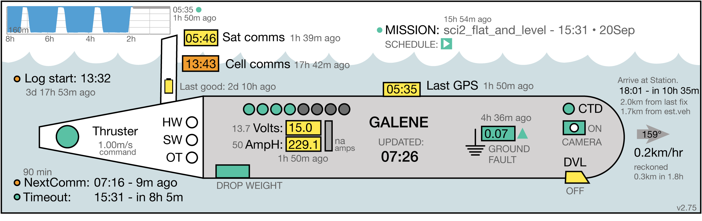

## LRAUV monitoring widget

These scripts generate summary graphics to capture the status of MBARI's long-range AUVs and the ESP gene sensor. The primary script is `auvstatus.py` which requires `LRAUV_svg.py` and `config_auv.py`. 

Usage:

    auvstatus.py -v pontus -r   # prints a report to the screen
    auvstatus.py -v daphne -f   # save to file called auv_daphne.svg

    -v --vehicle specifies the vehicle
    -b           turns on debugging output
    -r           prints report
    -f           save to SVG file directly
	-i           specify institution (whoi|mbari)


-----
The ESP widget takes similar arguments: `  esp_widget.py -v makai -f`

Adjust the server and path to save destination files inside `config_auv.py`.

The shell script `update-active.sh` is run at 2-minute intervals with a `cron` job to update the graphics and JSON files. It loops through a list of vehicles and calls the status scripts above. Set the list of vehicles inside the shell script. (Be sure to set `MAILTO=` in your crontab)
 
Scripts and cron jobs are run in the `widget` folder on the server.

To see the full "gallery" of vehicles being monitored, see [this page](https://okeanids.mbari.org/widget/)

-----

### INSTALLATION
* (Alternative: clone this repo and then copy the needed files into your local environment. Then you can get updates to the scripts.)

* Place these four scripts on your server, ideally in your _`<server>/widgets/`_ folder. (For ESP, add `esp_widget.py` and `ESPelements.py`)
    * `auvstatus.py`
    * `LRAUV_svg.py`
    * `config_auv.py`
    * `update-active.sh`

* Edit `config_auv.py` to set the server and path
* Test the script with `auvstatus.py -v <vehicle> -r    `   (Using `-r` outputs summary instead of SVG)
* Edit the `VEH` variable in `update-active.sh` to have a space-separated list of your vehicles to monitor
* Edit your cron (`crontab -e`) to run the updater script, for example: 
     * ```*/2 * * * * /var/www/html/widget/update-active.sh ```

### NOTES

  * This is written in python 2.7 (sorry:lazy) but should only require built-in libraries (The esp widget should work with either python 2.x or 3)
  * `LRAUV_svg.py` contains the SVG template for substitution of style fields
    - It needs to reside in the same folder as `auvstatus.py` to be imported
  * Opening the SVG in an illustration program will destructively reformat it 

## TODO

  * Long list of TODOs in the code, and see [Issues](https://bitbucket.org/beroe/auvstatus/issues?status=new&status=open) for more
## LEGEND:


