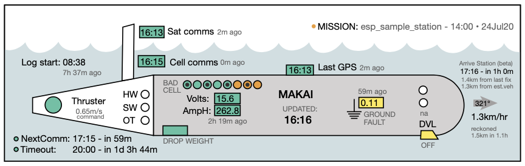

## LRAUV monitoring widget

Usage:

    auvstatus.py -v pontus -r   # prints a report to the screen
    auvstatus.py -v daphne -f   # save to file called auv_daphne.svg

    -v --vehicle specifies the vehicle
    -b           turns on debugging output
    -r           prints report
    -f           save to SVG file directly

To see the full "gallery" of vehicles being monitored, see [this page](https://okeanids.mbari.org/widget/)

Scripts and cron jobs are run in the `widget` folder on the server.

### NOTES

  * This is written in python 2.7 (sorry:lazy) but should only require built-in libraries
  * `LRAUV_svg.py` contains the template for substitution of style fields
    - It needs to reside in the same folder as auvstatus to be imported
  * Opening the SVG in an illustration program will destructively reformat it 
  * This alpha version is very FRAGILE and can crash with unexpected input

## TODO

  * Long list of TODOs in the code, and see [Issues](https://bitbucket.org/beroe/auvstatus/issues?status=new&status=open) for more

