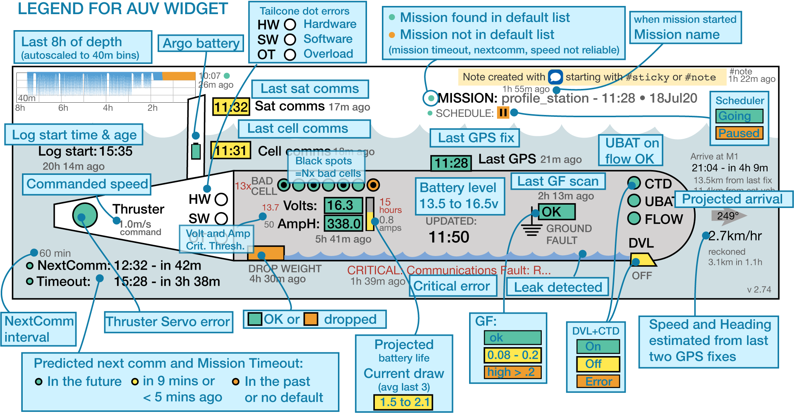

## LRAUV monitoring widget

Usage:

    auvstatus.py -v pontus -r   # prints a report to the screen
    auvstatus.py -v daphne -f   # save to file called auv_daphne.svg

    -v --vehicle specifies the vehicle
    -b           turns on debugging output
    -r           prints report
    -f           save to SVG file directly

    The ESP widget takes similar arguments:
        `esp_widget.py -v makai -f`

To see the full "gallery" of vehicles being monitored, see [this page](https://okeanids.mbari.org/widget/)

Two shell scripts `update-active.sh` and `updateauv.sh` are run at 2 and 15 minute intervals to call those scripts above.
 
Scripts and cron jobs are run in the `widget` folder on the server.

### NOTES

  * This is written in python 2.7 (sorry:lazy) but should only require built-in libraries (The esp widget should work with either python 2.x or 3)
  * `LRAUV_svg.py` contains the template for substitution of style fields
    - It needs to reside in the same folder as `auvstatus.py` to be imported
  * Opening the SVG in an illustration program will destructively reformat it 
  * This alpha version is very FRAGILE and can crash with unexpected input

## TODO

  * Long list of TODOs in the code, and see [Issues](https://bitbucket.org/beroe/auvstatus/issues?status=new&status=open) for more
## LEGEND:




## UPDATED API
```
    name=string: The field value is equal to the given string
    name.startsWith=string: The field value starts with the given string
    name.matches=string: The field value matches the given regular expression
    The first given variant as listed above is the only one applied for the particular field.
    This handling is done for the fields: `name, text, note, path, user, email.
    (Note: name gets reflected as component in the reported JSON object for some event types).
```
Regex style shown [here](https://docs.oracle.com/javase/8/docs/api/java/util/regex/Pattern.html).
